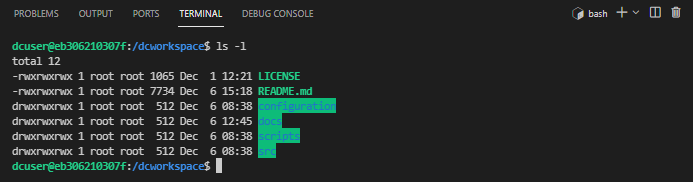

# How to share data securely and easily between organizations using Azure Data Share?
# Table of Contents
- [How to share data securely and easily between organizations using Azure Data Share?](#how-to-share-data-securely-and-easily-between-organizations-using-azure-data-share)
- [Table of Contents](#table-of-contents)
  - [Introduction](#introduction)
  - [Installing the pre-requisites](#installing-the-pre-requisites)
    - [Installing Git](#installing-git)
    - [Installing Docker and Visual Studio Code](#installing-docker-and-visual-studio-code)
  - [Installing the project](#installing-the-project)
    - [Clone the repository](#clone-the-repository)
    - [Launch Visual Studio Code with the dev container](#launch-visual-studio-code-with-the-dev-container)
  - [Architecture](#architecture)
  - [Deploying Sharing Node and Registry Server](#deploying-sharing-node-and-registry-server)
  - [Build and deploy container images](#build-and-deploy-container-images)
  - [Registry REST API reference](#registry-rest-api-reference)
    - [**Get Version**](#get-version)
      - [Url parameters](#url-parameters)
      - [Request Headers](#request-headers)
      - [Request Body](#request-body)
      - [Responses](#responses)
    - [**Get Time**](#get-time)
      - [Url parameters](#url-parameters-1)
      - [Request Headers](#request-headers-1)
      - [Request Body](#request-body-1)
      - [Responses](#responses-1)
    - [**Register node**](#register-node)
      - [Url parameters](#url-parameters-2)
      - [Request Headers](#request-headers-2)
      - [Request Body](#request-body-2)
      - [ShareNode](#sharenode)
      - [Responses](#responses-2)
    - [**Get nodes/{node_id}**](#get-nodesnode_id)
      - [Url parameters](#url-parameters-3)
      - [Request Headers](#request-headers-3)
      - [Request Body](#request-body-3)
      - [Responses](#responses-3)
      - [Node](#node)
    - [**Get nodes**](#get-nodes)
      - [Url parameters](#url-parameters-4)
      - [Request Headers](#request-headers-4)
      - [Request Body](#request-body-4)
      - [Responses](#responses-4)
    - [**Get share information from the consumer**](#get-share-information-from-the-consumer)
      - [Url parameters](#url-parameters-5)
      - [Request Headers](#request-headers-5)
      - [Request Body](#request-body-5)
      - [Responses](#responses-5)
      - [ConsumeResponse](#consumeresponse)
      - [Dataset](#dataset)
      - [Error](#error)
      - [StatusDetails](#statusdetails)
  - [Share REST API reference](#share-rest-api-reference)
    - [**Get Version**](#get-version-1)
      - [Url parameters](#url-parameters-6)
      - [Request Headers](#request-headers-6)
      - [Request Body](#request-body-6)
      - [Responses](#responses-6)
    - [**Get Time**](#get-time-1)
      - [Url parameters](#url-parameters-7)
      - [Request Headers](#request-headers-7)
      - [Request Body](#request-body-7)
      - [Responses](#responses-7)
    - [**Share**](#share)
      - [Url parameters](#url-parameters-8)
      - [Request Headers](#request-headers-8)
      - [Request Body](#request-body-8)
      - [ShareRequest](#sharerequest)
      - [Dataset](#dataset-1)
      - [Responses](#responses-8)
      - [ShareResponse](#shareresponse)
      - [Error](#error-1)
      - [StatusDetails](#statusdetails-1)
    - [**Get share**](#get-share)
      - [Url parameters](#url-parameters-9)
      - [Request Headers](#request-headers-9)
      - [Request Body](#request-body-9)
      - [Responses](#responses-9)
    - [**Get consume**](#get-consume)
      - [Url parameters](#url-parameters-10)
      - [Request Headers](#request-headers-10)
      - [Request Body](#request-body-10)
      - [Responses](#responses-10)
      - [ConsumeResponse](#consumeresponse-1)
    - [**Shareconsume**](#shareconsume)
      - [Url parameters](#url-parameters-11)
      - [Request Headers](#request-headers-11)
      - [Request Body](#request-body-11)
      - [Responses](#responses-11)
    - [**Get shareconsume**](#get-shareconsume)
      - [Url parameters](#url-parameters-12)
      - [Request Headers](#request-headers-12)
      - [Request Body](#request-body-12)
      - [Responses](#responses-12)
    - [**Get consumeshare**](#get-consumeshare)
      - [Url parameters](#url-parameters-13)
      - [Request Headers](#request-headers-13)
      - [Request Body](#request-body-13)
      - [Responses](#responses-13)
  - [Registry service source code](#registry-service-source-code)
    - [Data Models](#data-models)
    - [Application Settings](#application-settings)
    - [REST API](#rest-api)
    - [Services](#services)
  - [Sharing node service source code](#sharing-node-service-source-code)
    - [Data Models](#data-models-1)
    - [Application Settings](#application-settings-1)
    - [REST API](#rest-api-1)
    - [Services](#services-1)
  - [Unit tests](#unit-tests)
    - [Running unit tests with bash file launch-unit-tests.sh](#running-unit-tests-with-bash-file-launch-unit-testssh)
    - [Running unit tests with Visual Studio Code](#running-unit-tests-with-visual-studio-code)
  - [End-to-end tests](#end-to-end-tests)
    - [Calling the rest api from the Web browser](#calling-the-rest-api-from-the-web-browser)
    - [bash file integration-test.sh](#bash-file-integration-testsh)
    - [Pytest with test_datashare.py file](#pytest-with-test_datasharepy-file)
  - [Next steps](#next-steps)

## Introduction

The main objectives of this sample implementation of a REST API using Azure Data Share are:

- sharing securely data between organizations through Azure Data Share using isolated sharing nodes
- sharing easily data with a simple REST API (Scenario 1: POST /share and GET /consume or Scenario 2: POST/GET /shareconsume)
- offer a flexible implementation based on containers to support either Azure App Service, Azure Function, Azure Container Instance or Azure Kubernetes Architectures.

The solution consists in a set of sharing nodes deployed in different Azure Subscriptions. All the sharing nodes are isolated for security reason. As a sharing node if I want to share data with another sharing node I need to get the list of avaialable sharing nodes from a registry service which maintain this list.


This solution is based on two REST APIs:

- share REST API
- registry REST API


As those APIs can be hosted in containers running in Azure App Services, Azure Functions, Azure Container Instances, Azure Kubernetes Services.

## Installing the pre-requisites

In order to deploy and test this solution we recommend to use Docker, Visual Studio Code with a dev container.
This chapter describes how to install Git, Docker, Terraform and Visual Studio Code on Windows, MacOS and Linux.

### Installing Git

Git client will be required to clone the repository on your local machine. Git client can installed on Windows, MacOS, Linux.

[Installing Git on several platform](https://git-scm.com/book/en/v2/Getting-Started-Installing-Git)

### Installing Docker and Visual Studio Code

|[](https://www.docker.com/products/docker-desktop)|[](https://docs.docker.com/get-docker/)|[](https://www.docker.com/products/docker-desktop)|
| :--- | :--- | :--- |
| [Docker Desktop](https://www.docker.com/products/docker-desktop) 2.0+ on Windows 10 Pro/Enterprise. Windows 10 Home (2004+) requires Docker Desktop 2.3+ and the [WSL 2 back-end](https://docs.docker.com/desktop/windows/wsl/). (Docker Toolbox is not supported. Windows container images are not supported.) <br />[Visual Studio Code](https://code.visualstudio.com/docs/setup/windows)|  [Docker CE/EE](https://docs.docker.com/get-docker/) 18.06+ and [Docker Compose](https://docs.docker.com/compose/install/) 1.21+. (The Ubuntu snap package is not supported.) <br />[Visual Studio Code](https://code.visualstudio.com/docs/setup/linux) &nbsp;&nbsp; &nbsp;&nbsp; &nbsp;&nbsp; &nbsp;&nbsp; &nbsp;&nbsp; &nbsp;&nbsp; &nbsp;&nbsp; &nbsp;&nbsp; &nbsp;&nbsp; &nbsp;&nbsp; &nbsp;&nbsp; &nbsp;&nbsp; &nbsp;&nbsp; &nbsp;&nbsp; &nbsp;&nbsp; &nbsp;&nbsp; &nbsp;&nbsp; &nbsp;&nbsp; &nbsp;&nbsp; &nbsp;&nbsp; &nbsp;&nbsp; &nbsp;&nbsp; &nbsp; &nbsp;&nbsp; &nbsp;&nbsp; &nbsp;&nbsp; &nbsp;&nbsp; &nbsp;&nbsp; &nbsp;&nbsp; &nbsp;&nbsp; &nbsp;&nbsp; &nbsp;&nbsp; &nbsp;&nbsp; &nbsp;&nbsp; &nbsp;&nbsp; &nbsp;&nbsp; &nbsp;&nbsp; &nbsp;&nbsp; &nbsp;&nbsp; &nbsp;&nbsp; &nbsp;&nbsp; &nbsp;&nbsp; &nbsp;&nbsp; &nbsp;&nbsp; &nbsp;&nbsp; &nbsp;&nbsp; &nbsp;&nbsp; &nbsp;&nbsp; &nbsp;&nbsp; &nbsp;&nbsp; &nbsp;&nbsp; &nbsp;&nbsp; &nbsp;&nbsp; &nbsp;&nbsp; &nbsp;&nbsp; &nbsp;&nbsp; &nbsp;&nbsp; &nbsp;&nbsp; &nbsp;&nbsp; &nbsp;&nbsp; &nbsp; &nbsp;&nbsp; &nbsp;&nbsp; &nbsp;&nbsp; &nbsp;&nbsp; &nbsp;&nbsp; &nbsp;&nbsp; &nbsp;&nbsp; &nbsp;&nbsp; &nbsp;&nbsp; &nbsp;&nbsp; &nbsp;&nbsp; &nbsp;&nbsp; &nbsp;&nbsp; &nbsp;&nbsp; &nbsp;&nbsp; &nbsp;&nbsp; &nbsp;&nbsp; &nbsp;&nbsp; &nbsp;&nbsp; &nbsp;&nbsp; &nbsp;&nbsp; &nbsp;&nbsp; &nbsp;&nbsp; &nbsp;&nbsp; &nbsp;&nbsp; &nbsp;&nbsp; &nbsp;&nbsp; &nbsp;&nbsp; &nbsp;&nbsp; &nbsp;&nbsp; &nbsp;&nbsp; &nbsp;&nbsp; &nbsp;&nbsp; &nbsp;&nbsp; &nbsp;&nbsp; &nbsp;&nbsp; &nbsp;&nbsp; &nbsp; &nbsp;&nbsp; &nbsp;&nbsp; &nbsp;&nbsp; &nbsp;&nbsp; &nbsp;&nbsp; &nbsp;&nbsp; &nbsp;&nbsp; &nbsp;&nbsp; &nbsp;&nbsp; &nbsp;&nbsp; &nbsp;&nbsp; &nbsp;&nbsp; &nbsp;&nbsp; &nbsp;&nbsp; &nbsp;&nbsp; &nbsp;&nbsp; &nbsp;&nbsp; &nbsp;&nbsp; &nbsp;&nbsp; &nbsp;&nbsp; &nbsp;&nbsp; &nbsp;&nbsp; &nbsp;&nbsp;    | [Docker Desktop](https://www.docker.com/products/docker-desktop) 2.0+. <br />[Visual Studio Code](https://code.visualstudio.com/docs/setup/mac) &nbsp;&nbsp; &nbsp;&nbsp; &nbsp;&nbsp; &nbsp;&nbsp; &nbsp;&nbsp; &nbsp;&nbsp; &nbsp;&nbsp; &nbsp;&nbsp; &nbsp;&nbsp; &nbsp;&nbsp; &nbsp;&nbsp; &nbsp;&nbsp; &nbsp;&nbsp; &nbsp;&nbsp; &nbsp;&nbsp; &nbsp;&nbsp; &nbsp;&nbsp; &nbsp;&nbsp; &nbsp;&nbsp; &nbsp;&nbsp; &nbsp;&nbsp; &nbsp;&nbsp; &nbsp; &nbsp;&nbsp; &nbsp;&nbsp; &nbsp;&nbsp; &nbsp;&nbsp; &nbsp;&nbsp; &nbsp;&nbsp; &nbsp;&nbsp; &nbsp;&nbsp; &nbsp;&nbsp; &nbsp;&nbsp; &nbsp;&nbsp; &nbsp;&nbsp; &nbsp;&nbsp; &nbsp;&nbsp; &nbsp;&nbsp; &nbsp;&nbsp; &nbsp;&nbsp; &nbsp;&nbsp; &nbsp;&nbsp; &nbsp;&nbsp; &nbsp;&nbsp; &nbsp;&nbsp; &nbsp;&nbsp; &nbsp;&nbsp; &nbsp;&nbsp; &nbsp;&nbsp; &nbsp;&nbsp; &nbsp;&nbsp; &nbsp;&nbsp; &nbsp;&nbsp; &nbsp;&nbsp; &nbsp;&nbsp; &nbsp;&nbsp; &nbsp;&nbsp; &nbsp;&nbsp; &nbsp;&nbsp; &nbsp;&nbsp; &nbsp; &nbsp;&nbsp; &nbsp;&nbsp; &nbsp;&nbsp; &nbsp;&nbsp; &nbsp;&nbsp; &nbsp;&nbsp; &nbsp;&nbsp; &nbsp;&nbsp; &nbsp;&nbsp; &nbsp;&nbsp; &nbsp;&nbsp; &nbsp;&nbsp; &nbsp;&nbsp; &nbsp;&nbsp; &nbsp;&nbsp; &nbsp;&nbsp; &nbsp;&nbsp; &nbsp;&nbsp; &nbsp;&nbsp; &nbsp;&nbsp; &nbsp;&nbsp; &nbsp;&nbsp; &nbsp;&nbsp; &nbsp;&nbsp; &nbsp;&nbsp; &nbsp;&nbsp; &nbsp;&nbsp; &nbsp;&nbsp; &nbsp;&nbsp; &nbsp;&nbsp; &nbsp;&nbsp; &nbsp;&nbsp; &nbsp;&nbsp; &nbsp;&nbsp; &nbsp;&nbsp; &nbsp;&nbsp; &nbsp;&nbsp; &nbsp; &nbsp;&nbsp; &nbsp;&nbsp; &nbsp;&nbsp; &nbsp;&nbsp; &nbsp;&nbsp; &nbsp;&nbsp; &nbsp;&nbsp; &nbsp;&nbsp; &nbsp;&nbsp; &nbsp;&nbsp; &nbsp;&nbsp; &nbsp;&nbsp; &nbsp;&nbsp; &nbsp;&nbsp; &nbsp;&nbsp;  |

## Installing the project

### Clone the repository

For you local machine running Windows or MacOS or Linux, open a Terminal and run the following command. 

1. Create a directory to copy the repository

      mkdir myproject

      cd myproject

2. Clone the repository

      git clone https://CSECodeHub@dev.azure.com/CSECodeHub/409271%20-%20Bertelsmann%20-%20Global%20Data%20Platform/_git/sharing-data-rest-api

### Launch Visual Studio Code with the dev container

1. In the same terminal, navigate to the project folder

      cd sharing-data-rest-api

2. Launch Visual Studio Code from your terminal with the following command:

      code .

3. A first dialog box will appear asking the question "Do you trust the authors of the files in this folder?", click on the Yes button.

    

4. A second dialog box will appear asking whether you want to open the project with a dev container. Click on the button "reopen in container"

    

5. Visual Studio Code will build the dev container. After few minutes, the dev container has been built, you you can open a shell running on this dev container

    

6. Select the sub menu "New Terminal" in the menu "Terminal".

    

7. Select the sub menu "New Terminal" in the menu "Terminal". The Terminal appears, and you can use linux shell commands like "ls -l"

    

8. You are now ready to run:
   - locally the REST APIs,
   - in a local docker container the REST APIs,
   - in docker containers in Azure App Services the REST APIs  
  The Dev Container is configured to support the following tools:
   - Azure CLI
   - Docker CLI
   - docker-compose
   - python/pip
   - Terraform

## Architecture

The solution is based on a set of sharing nodes deployed in different organizations in different Azure Subscriptions.
Each sharing node is defined with :

- Azure Storage Account where the datasets are stored
- Azure Data Share used to share data amongst subscriptions
- Azure Container Registry used to store the container images of the share rest API
- Azure App Service hosting the share rest API

When a new sharing node is deployed, it registers its url, its tenant id and the managed identity in the registry server using the register rest API.
Once the sharing node is registered, this node is visible from the other sharing nodes. It can share data with the other sharing nodes and consume data from the other nodes.


Below the architecture based on Azure App Service hosting the rest APIs


Below the architecture based on Azure Function hosting the rest APIs


The schema below describe the registration mecanism using the register rest API. Every 60 seconds, each sharing node register its name, url, tenant id and managed identity in the registry server using the POST /register API. Moreover, the registry server will remove from the list of avaiable nodes the node which have not been registered during the latest minute.


Once the node is registered, it's possible to share data with other node with two possible scenarios.

For the first scenario, the user of the organization which will share data will call the share rest API to trigger the sharing process with the recipient node (POST /share). The Azure Data Share will send an invitation to the recipient Data Share.
The source user will the invitation_id with the user of the recipient organization.
Then this user will call the consume rest API with the invitation_id as a parameter to receive the data (GET /consume).
This scenarion will require 2 users.


For the second scenario, the user of the organization which will share data will call the share rest API to trigger the sharing process with the recipient node. The Azure Data Share will send an invitation to the recipient Data Share.
Then the source user will call the shareconsume API to consume remotely the data in the recipient node (POST /shareconsume). Once the data is copied in the recipient Azure Storage, the shareconsume API returns the storage account, the container name, the folder path and the file name where the received dataset is stored (GET /shareconsume).
The source user can now share the storage account, the container name, the folder path and the file name with the recipient user.


## Deploying Sharing Node and Registry Server

The infrastructure associated with the registry server and the sharing node are deployed using ARM templates.

Template for the registry service: **scripts/arm-registry-template.json**:

```json
{
  "$schema": "https://schema.management.azure.com/schemas/2019-04-01/deploymentTemplate.json#",
  "contentVersion": "1.0.0.0",
  "parameters": {
    "name": {
      "type": "string",
      "defaultValue": "[concat('webapp', uniqueString(resourceGroup().id))]",
      "minLength": 2,
      "metadata": {
        "description": "Web app name."
      }
    },
    "location": {
      "type": "string",
      "defaultValue": "[resourceGroup().location]",
      "metadata": {
        "description": "Location for all resources."
      }
    },
    "sku": {
      "type": "string",
      "defaultValue": "B1",
      "metadata": {
        "description": "The SKU of App Service Plan."
      }
    }
  },
  "variables": {
    "webAppName": "[concat('webapp', parameters('name'))]",
    "appServicePlanName": "[concat('plan', parameters('name'))]",
    "containerRegistryName": "[concat('acr', parameters('name'))]"
  },
  "resources": [
    {
      "type": "Microsoft.Web/serverfarms",
      "apiVersion": "2020-06-01",
      "name": "[variables('appServicePlanName')]",
      "location": "[parameters('location')]",
      "sku": {
        "name": "[parameters('sku')]"
      },
      "kind": "linux",
      "properties": {
        "reserved": true
      }
    },
    {
      "type": "Microsoft.Web/sites",
      "apiVersion": "2020-06-01",
      "name": "[variables('webAppName')]",
      "location": "[parameters('location')]",
      "kind": "app,linux,container",
      "identity": {
        "type": "SystemAssigned"
      },      
      "dependsOn": [
        "[resourceId('Microsoft.Web/serverfarms', variables('appServicePlanName'))]"
      ],
      "properties": {
        "serverFarmId": "[resourceId('Microsoft.Web/serverfarms', variables('appServicePlanName'))]"
      }
    },
    {
      "type": "Microsoft.ContainerRegistry/registries",
      "apiVersion": "2017-10-01",
      "name": "[variables('containerRegistryName')]",
      "location": "[resourceGroup().location]",
      "sku": {
        "name": "Standard",
        "tier": "Standard"
      },
      "properties": {
        "adminUserEnabled": false
      }
    }
  ],
  "outputs": {
    "acrLoginServer": {
      "type": "string",
      "value": "[reference(resourceId('Microsoft.ContainerRegistry/registries',variables('containerRegistryName')),'2017-10-01').loginServer]"
    },    
    "webAppName": {
      "type": "string",
      "value": "[variables('webAppName')]"
    },   
    "webAppServer": {
      "type": "string",
      "value": "[concat(variables('webAppName'),'.azurewebsites.net')]"
    },
    "acrName": {
      "type": "string",
      "value": "[variables('containerRegistryName')]"
    },
    "webAppTenantId": {
      "type": "string",
      "value": "[reference(resourceId('Microsoft.Web/sites',variables('webAppName')), '2018-02-01', 'Full').identity.tenantId]"
    },
    "webAppObjectId": {
      "type": "string",
      "value": "[reference(resourceId('Microsoft.Web/sites',variables('webAppName')), '2018-02-01', 'Full').identity.principalId]"
    }    
  }
}
```

Template for the sharing node service: **scripts/arm-share-template.json**:

```json
{
  "$schema": "https://schema.management.azure.com/schemas/2019-04-01/deploymentTemplate.json#",
  "contentVersion": "1.0.0.0",
  "parameters": {
    "name": {
      "type": "string",
      "defaultValue": "[concat('webapp', uniqueString(resourceGroup().id))]",
      "minLength": 2,
      "metadata": {
        "description": "Web app name."
      }
    },
    "location": {
      "type": "string",
      "defaultValue": "[resourceGroup().location]",
      "metadata": {
        "description": "Location for all resources."
      }
    },
    "sku": {
      "type": "string",
      "defaultValue": "B1",
      "metadata": {
        "description": "The SKU of App Service Plan."
      }
    }
  },
  "variables": {
    "webAppName": "[concat('webapp', parameters('name'))]",
    "appServicePlanName": "[concat('plan', parameters('name'))]",
    "containerRegistryName": "[concat('acr', parameters('name'))]",
    "dataShareAccountName": "[concat('ds', parameters('name'))]",
    "storageAccountName": "[take(concat('sa', parameters('name')),24)]",
    "storageShareContainerName":"[take(concat('share', parameters('name')),63)]",
    "storageConsumeContainerName":"[take(concat('consume', parameters('name')),63)]"   
  },
  "resources": [
    {
      "type": "Microsoft.Web/serverfarms",
      "apiVersion": "2020-06-01",
      "name": "[variables('appServicePlanName')]",
      "location": "[parameters('location')]",
      "sku": {
        "name": "[parameters('sku')]"
      },
      "kind": "linux",
      "properties": {
        "reserved": true
      }
    },
    {
      "type": "Microsoft.Web/sites",
      "apiVersion": "2020-06-01",
      "name": "[variables('webAppName')]",
      "location": "[parameters('location')]",
      "kind": "app,linux,container",
      "identity": {
        "type": "SystemAssigned"
      },      
      "dependsOn": [
        "[resourceId('Microsoft.Web/serverfarms', variables('appServicePlanName'))]"
      ],
      "properties": {
        "serverFarmId": "[resourceId('Microsoft.Web/serverfarms', variables('appServicePlanName'))]"
      }
    },
    {
      "type": "Microsoft.ContainerRegistry/registries",
      "apiVersion": "2017-10-01",
      "name": "[variables('containerRegistryName')]",
      "location": "[resourceGroup().location]",
      "sku": {
        "name": "Standard",
        "tier": "Standard"
      },
      "properties": {
        "adminUserEnabled": false
      }
    },
    {
      "type": "Microsoft.DataShare/accounts",
      "apiVersion": "2019-11-01",
      "name": "[variables('dataShareAccountName')]",
      "location": "[resourceGroup().location]",
      "identity": {
        "type": "SystemAssigned"
      },
      "properties": {}
    },
    {
      "type": "Microsoft.Storage/storageAccounts",
      "sku": {
        "name": "Standard_LRS",
        "tier": "Standard"
      },
      "kind": "StorageV2",
      "name": "[variables('storageAccountName')]",
      "apiVersion": "2019-04-01",
      "location":  "[resourceGroup().location]",
      "properties": {
        "isHnsEnabled": false,
        "supportsHttpsTrafficOnly": true,
        "encryption": {
          "services": {
            "file": {
              "enabled": true
            },
            "blob": {
              "enabled": true
            }
          },
          "keySource": "Microsoft.Storage"
        },
        "accessTier": "Hot"
      }
    },
    {
      "type": "Microsoft.Storage/storageAccounts/blobServices",
      "apiVersion": "2019-04-01",
      "name": "[concat(variables('storageAccountName'), '/default')]",
      "dependsOn": [
        "[resourceId('Microsoft.Storage/storageAccounts', variables('storageAccountName'))]"
      ],
      "properties": {
        "cors": {
          "corsRules": []
        },
        "deleteRetentionPolicy": {
          "enabled": false
        }
      }
    },
    {
      "type": "Microsoft.Storage/storageAccounts/blobServices/containers",
      "apiVersion": "2019-04-01",
      "name": "[concat(variables('storageAccountName'), '/default/',variables('storageShareContainerName'))]",
      "dependsOn": [
        "[resourceId('Microsoft.Storage/storageAccounts', variables('storageAccountName'))]"
      ],
      "properties": {
        "publicAccess": "None"
      }
    },
    {
      "type": "Microsoft.Storage/storageAccounts/blobServices/containers",
      "apiVersion": "2019-04-01",
      "name": "[concat(variables('storageAccountName'), '/default/',variables('storageConsumeContainerName'))]",
      "dependsOn": [
        "[resourceId('Microsoft.Storage/storageAccounts', variables('storageAccountName'))]"
      ],
      "properties": {
        "publicAccess": "None"
      }
    }        
  ],
  "outputs": {
    "acrLoginServer": {
      "type": "string",
      "value": "[reference(resourceId('Microsoft.ContainerRegistry/registries',variables('containerRegistryName')),'2017-10-01').loginServer]"
    },
    "webAppName": {
      "type": "string",
      "value": "[variables('webAppName')]"
    },        
    "webAppServer": {
      "type": "string",
      "value": "[concat(variables('webAppName'),'.azurewebsites.net')]"
    },
    "acrName": {
      "type": "string",
      "value": "[variables('containerRegistryName')]"
    },
    "webAppTenantId": {
      "type": "string",
      "value": "[reference(resourceId('Microsoft.Web/sites',variables('webAppName')), '2018-02-01', 'Full').identity.tenantId]"
    },
    "webAppObjectId": {
      "type": "string",
      "value": "[reference(resourceId('Microsoft.Web/sites',variables('webAppName')), '2018-02-01', 'Full').identity.principalId]"
    },
    "storageAccountName": {
      "type": "string",
      "value": "[variables('storageAccountName')]"
    },
    "consumeContainerName": {
      "type": "string",
      "value": "[variables('storageConsumeContainerName')]"
    },
    "shareContainerName": {
      "type": "string",
      "value": "[variables('storageShareContainerName')]"
    },
    "dataShareAccountName": {
      "type": "string",
      "value": "[variables('dataShareAccountName')]"
    }
  }
}
```

The bash script **scripts/deploy-registry.sh** is used to deploy the registry service.
The bash script **scripts/deploy-share.sh** is used to deploy the sharing node service.

When you launch those bash scripts the first argument is the path to the file containing the environment variables.

For instance:

  ./scripts/deploy-registry.sh ./configuration/.registry.env
  ./scripts/deploy-registry.sh ./configuration/.sharea.env

Below the variables which will be set in those environement variables:

- AZURE_SUBSCRIPTION_ID: the Azure subscription id where the registry or node sharing will be deployed
- AZURE_TENANT_ID: the Azure Tenant id used for the authentication with Azure
- AZURE_REGION: the Azure region where the infrastructure will be deployed
- APP_PREFIX: the prefix used to create the name for the Azure resouces for instance: "reghub", "corpa", "corpb", this prefix is also the name of the sharing node   
- APP_NAME: the name used to create the name for the Azure resouces, the default value is "${APP_PREFIX}{4 digit random id}"
- APP_VERSION: The Application version to deploy for instance: 211216.165403, by default this variable is set using the current date and time

Below sample environement file for registry:

```env
        AZURE_SUBSCRIPTION_ID="yyyyyyyy-yyyy-yyyy-yyyy-yyyyyyyyyyyy"
        AZURE_TENANT_ID="xxxxxxxx-xxxx-xxxx-xxxx-xxxxxxxxxxxx"
        AZURE_REGION="eastus2"
        APP_PREFIX="reghub"
        APP_NAME="reghub0001"
        APP_VERSION="211216.165403"
```

Below sample environement file for sharing node:

```env
        AZURE_SUBSCRIPTION_ID="yyyyyyyy-yyyy-yyyy-yyyy-yyyyyyyyyyyy"
        AZURE_TENANT_ID="xxxxxxxx-xxxx-xxxx-xxxx-xxxxxxxxxxxx"
        AZURE_REGION="eastus2"
        APP_PREFIX="sharea"
        APP_NAME="sharea0001"
        APP_VERSION="211216.165403"
```

 

THose bash scripts files are called from the bash file **./scripts/integration-test.sh** which will deploy the infrastructure.
Once the infrastructure is deployed, it will :

- build the container images for the regsitry and the sharing node,
- deploy the container images to the App Services,
- Test sharing scenario 1 (POST /share, GET /consume)
- Test sharing scenario 2 (POST/GET shareconsume)
- Undeploy the infrastructure

The scripts **./scripts/undeploy-registry.sh** and  **./scripts/undeploy-share.sh** will undeploy the infrastructure.


## Build and deploy container images

The registry and sharing node container images are built using the following scripts:

- **scripts/build-container-registry.sh**
- **scripts/build-container-share.sh**

When you launch those bash scripts the first argument is the path to the file containing the environment variables.

For instance:

  ./scripts/build-container-registry.sh ./configuration/.registry.env
  ./scripts/build-container-share.sh ./configuration/.sharea.env

The registry image is built using the following multi-stages Dockerfile:

```yaml
ARG ARG_PORT_HTTP=8000
ARG ARG_APP_VERSION="1.0.0.1"
# stage 1
FROM tiangolo/uvicorn-gunicorn-fastapi:python3.8-slim AS build-image

WORKDIR /src
COPY ./requirements.txt ./
COPY ./setup.py ./
COPY ./src/ ./src
RUN pip install -r requirements.txt
RUN PYTHONPATH=./src python3 -m setup bdist_wheel

# stage 2
FROM tiangolo/uvicorn-gunicorn-fastapi:python3.8-slim AS release-image
ARG ARG_PORT_HTTP
ENV PORT_HTTP ${ARG_PORT_HTTP}

ARG ARG_APP_VERSION
ENV APP_VERSION=${ARG_APP_VERSION}

WORKDIR /app

COPY --from=build-image ./src/dist/*.whl /app/packages/
COPY ./src/app.py /app
COPY ./src/main.py /app
COPY ./src/log_service.py /app
COPY ./src/models.py /app
COPY ./src/registry_service.py /app
COPY ./src/configuration_service.py /app
COPY ./entrypoint.sh /app
COPY ./requirements.txt /app

RUN pip install -r requirements.txt
RUN python -m pip install packages/*.whl
EXPOSE $PORT_HTTP/tcp

CMD ["./entrypoint.sh"]

```

The share image is built using the following multi-stage Dockerfile:

```yaml
ARG ARG_PORT_HTTP=8000
ARG ARG_APP_VERSION="1.0.0.1"
# stage 1
FROM tiangolo/uvicorn-gunicorn-fastapi:python3.8-slim AS build-image

WORKDIR /src
COPY ./requirements.txt ./
COPY ./setup.py ./
COPY ./src/ ./src
RUN pip install -r requirements.txt
RUN PYTHONPATH=./src python3 -m setup bdist_wheel

# stage 2
FROM tiangolo/uvicorn-gunicorn-fastapi:python3.8-slim AS release-image
ARG ARG_PORT_HTTP
ENV PORT_HTTP ${ARG_PORT_HTTP}

ARG ARG_APP_VERSION
ENV APP_VERSION=${ARG_APP_VERSION}

WORKDIR /app

COPY --from=build-image ./src/dist/*.whl /app/packages/
COPY ./src/app.py /app
COPY ./src/main.py /app
COPY ./src/log_service.py /app
COPY ./src/models.py /app
COPY ./src/share_service.py /app
COPY ./src/datashare_service.py /app
COPY ./src/configuration_service.py /app
COPY ./entrypoint.sh /app
COPY ./requirements.txt /app

RUN pip install -r requirements.txt
RUN python -m pip install packages/*.whl
EXPOSE $PORT_HTTP/tcp

CMD ["./entrypoint.sh"]

```

The registry and sharing node container images are deployed using the following scripts:

- **scripts/deploy-container-registry.sh**
- **scripts/deploy-container-share.sh**

When you launch those bash scripts the first argument is the path to the file containing the environment variables.
For the deployment of the sharing node, the second argument is the url of the registry server.

For instance:

  ./scripts/deploy-container-registry.sh ./configuration/.registry.env
  ./scripts/deploy-container-share.sh ./configuration/.sharea.env  "https://webappreghub0000.azurewebsites.net"
  ./scripts/deploy-container-share.sh ./configuration/.shareb.env  "https://webappreghub0000.azurewebsites.net"

All those REST API image expose the following APIs :

- **GET /version** which returns the container image version which is used to check when the new version of the image is deployed
- **GET /time** which returns the current time to check whether the service is still running

The scripts **deploy-container-registry.sh** and **deploy-container-share.sh** used the API GET /version to check whether the new image has been correctly deloyed.
If after 420 seconds, the version API doesn't return the expected version, the deployment of the image will fail.  

## Registry REST API reference

This chapter describes the Regsitry REST API.

### **Get Version**

```text
  GET /version
```

This method returns the current version of the service. By default, when the container is built, the version is set with the following command:

```bash  
  APP_VERSION=$(date +"%y%m%d.%H%M%S")
```

#### Url parameters

| Name     | In     | Required    | Type | Description |
| -------- | -------- | ----------- | --------- | --------------------------------------------- |
| None |  |  |  |  |

#### Request Headers

| Name     | Required    | Type | Description |
| -------- | ----------- | --------- | --------------------------------------------- |
| Content-Type | Yes | string | default value: 'application/json' |

#### Request Body

| Name     | Type | Description |
| -------- | --------- | --------------------------------------------- |
| None |   |  |

#### Responses

| Name     | Type | Description |
| -------- | --------- | --------------------------------------------- |
| 200 OK | string | the current version of the service in the following format:<br> %y%m%d.%H%M%S  |
| Other Status Code |    | An error response received from the service  |

### **Get Time**

```text
  GET /time
```

This method returns the universal time for the service. By default, the time is returned with the following format:

```bash  
  "%Y/%m/%d-%H:%M:%S"
```

#### Url parameters

| Name     | In     | Required    | Type | Description |
| -------- | -------- | ----------- | --------- | --------------------------------------------- |
| None |  |  |  |  |

#### Request Headers

| Name     | Required    | Type | Description |
| -------- | ----------- | --------- | --------------------------------------------- |
| Content-Type | Yes | string | default value: 'application/json' |

#### Request Body

| Name     | Type | Description |
| -------- | --------- | --------------------------------------------- |
| None |   |  |

#### Responses

| Name     | Type | Description |
| -------- | --------- | --------------------------------------------- |
| 200 OK | string | the universal time for the service in the following format:<br> %Y/%m/%d-%H:%M:%S  |
| Other Status Code |    | An error response received from the service  |

### **Register node**

```text
  POST /register
```

This method register the sharing node the input parameters in the body.

#### Url parameters

| Name     | In     | Required    | Type | Description |
| -------- | -------- | ----------- | --------- | --------------------------------------------- |
| None |  |  |  |  |

#### Request Headers

| Name     | Required    | Type | Description |
| -------- | ----------- | --------- | --------------------------------------------- |
| Content-Type | Yes | string | default value: 'application/json' |

#### Request Body

| Name     | Type | Description |
| -------- | --------- | --------------------------------------------- |
| share node | [ShareNode](#sharenode) | Object containing all the information to create the pipeline |

#### ShareNode

| Name     | Type | Description |
| -------- | --------- | --------------------------------------------- |
| node_id | string | The node id, this value must be unique for all the share nodes deployed |
| url   | string | The url of this share node  |
| name   | string | The name of the share node.  |
| tenant_id | string | The tenant id associated with the share node service  |
| identity   | string | The managed identity of the Azure App service hosting the share node service  |

#### Responses

| Name     | Type | Description |
| -------- | --------- | --------------------------------------------- |
| 200 OK | [ShareNode](#sharenode) | The object containing the new share node  |
| Other Status Code |    | An error response received from the service  |


### **Get nodes/{node_id}**

```text
  GET /nodes/{node_id}
```

This method get information about a node using the node id to retrieve the node information.

#### Url parameters

| Name     | In     | Required    | Type | Description |
| -------- | -------- | ----------- | --------- | --------------------------------------------- |
| node_id | path  | Yes | string | The node id used to register the share node.  |

#### Request Headers

| Name     | Required    | Type | Description |
| -------- | ----------- | --------- | --------------------------------------------- |
| Content-Type | Yes | string | default value: 'application/json' |

#### Request Body

| Name     | Type | Description |
| -------- | --------- | --------------------------------------------- |
| None |  |  |

#### Responses

| Name     | Type | Description |
| -------- | --------- | --------------------------------------------- |
| 200 OK | [Node](#node) | The object containing the information related to the node  |
| Other Status Code |    | An error response received from the service  |

#### Node

| Name     | Type | Description |
| -------- | --------- | --------------------------------------------- |
| node_id | string | The node id, this value must be unique for all the share nodes deployed |
| tenant_id | string | The tenant id associated with the share node service  |
| identity   | string | The managed identity of the Azure App service hosting the share node service  |

### **Get nodes**

```text
  GET /nodes
```

This method return the list of nodes currently registered.

#### Url parameters

| Name     | In     | Required    | Type | Description |
| -------- | -------- | ----------- | --------- | --------------------------------------------- |
| None |  |  |  |  |

#### Request Headers

| Name     | Required    | Type | Description |
| -------- | ----------- | --------- | --------------------------------------------- |
| Content-Type | Yes | string | default value: 'application/json' |

#### Request Body

| Name     | Type | Description |
| -------- | --------- | --------------------------------------------- |
| None |  |  |

#### Responses

| Name     | Type | Description |
| -------- | --------- | --------------------------------------------- |
| 200 OK | List[Node](#node) | The list of nodes currently registered  |
| Other Status Code |    | An error response received from the service  |

### **Get share information from the consumer**

```text
  GET /shareconsume
```

This method get share information from the consumer using is {pipeline_name} and the {run_id}.

#### Url parameters

| Name     | In     | Required    | Type | Description |
| -------- | -------- | ----------- | --------- | --------------------------------------------- |
| provider_node_id | query | Yes | string | The provider node id which triggered the share process.  |
| consumer_node_id | query | Yes | string | The consumer node id.  |
| invitation_id | query | Yes | string | The invitation id returned where the share process has been triggered.  |

#### Request Headers

| Name     | Required    | Type | Description |
| -------- | ----------- | --------- | --------------------------------------------- |
| Content-Type | Yes | string | default value: 'application/json' |

#### Request Body

| Name     | Type | Description |
| -------- | --------- | --------------------------------------------- |
| None |  |  |

#### Responses

| Name     | Type | Description |
| -------- | --------- | --------------------------------------------- |
| 200 OK | [ConsumeResponse](#consumeresponse) | The object containing the information related to the share process on the consumer side.  |
| Other Status Code |    | An error response received from the service  |

#### ConsumeResponse

| Name     | Type | Description |
| -------- | --------- | --------------------------------------------- |
| invitation_id | string | The invitation id used to consumer the dataset |
| provider_node_id | query | Yes | string | The provider node id which triggered the share process.  |
| consumer_node_id | query | Yes | string | The consumer node id.  |
| dataset | [Dataset](#dataset) | The object defining the received dataset |
| status   | [StatusDetails](#statusdetails) | The object defining the sink dataset |
| error   | [Error](#error) | The object containing the error information if an error occurred. If error.code is 0, no error occurred |


#### Dataset

| Name     | Type | Description |
| -------- | --------- | --------------------------------------------- |
| resource_group_name | string | The resource group associated with the storage account where the dataset is stored |
| storage_account_name | string | The storage account name associated with the storage account where the dataset is stored |
| container_name | string | The container name associated with the storage account where the dataset is stored |
| folder_path | string | The folder path in the container where the dataset is stored |
| file_name | string | The file name where the dataset is stored |

#### Error

| Name     | Type | Description |
| -------- | --------- | --------------------------------------------- |
| code | int | The error code associated with the error:<br>    NO_ERROR = 0<br>SHARING_DATASET_ERROR = 1<br>    SHARING_DATASET_EXCEPTION = 2<br>    CONSUMING_DATASET_ERROR = 3<br>   CONSUMING_DATASET_EXCEPTION = 4<br>    SYNCHRONIZATION_ERROR = 5 |
| message | string | The error message providing further information about the error |
| source   | string | The origin of the error, for instance: 'share_rest_api' |
| date   | datetime | Time when the error occurred.  |

#### StatusDetails

| Name     | Type | Description |
| -------- | --------- | --------------------------------------------- |
| status | string | The status of the share process:<br>    IN_PROGRESS = "InProgress"<br>    PENDING = "Pending"<br>    QUEUED = "Queued"<br>    FAILED = "Failed"<br>    SUCCEEDED = "Succeeded"|
| start | datetime | The time when the share process has been triggered |
| end | datetime | The time when the share process has been completed |
| duration | int | The duration of the share process in milliseconds |

## Share REST API reference

This chapter describes the Share REST API.
### **Get Version**

```text
  GET /version
```

This method returns the current version of the service. By default, when the container is built, the version is set with the following command:

```bash  
  APP_VERSION=$(date +"%y%m%d.%H%M%S")
```

#### Url parameters

| Name     | In     | Required    | Type | Description |
| -------- | -------- | ----------- | --------- | --------------------------------------------- |
| None |  |  |  |  |

#### Request Headers

| Name     | Required    | Type | Description |
| -------- | ----------- | --------- | --------------------------------------------- |
| Content-Type | Yes | string | default value: 'application/json' |

#### Request Body

| Name     | Type | Description |
| -------- | --------- | --------------------------------------------- |
| None |   |  |

#### Responses

| Name     | Type | Description |
| -------- | --------- | --------------------------------------------- |
| 200 OK | string | the current version of the service in the following format:<br> %y%m%d.%H%M%S  |
| Other Status Code |    | An error response received from the service  |

### **Get Time**

```text
  GET /time
```

This method returns the universal time for the service. By default, the time is returned with the following format:

```bash  
  "%Y/%m/%d-%H:%M:%S"
```

#### Url parameters

| Name     | In     | Required    | Type | Description |
| -------- | -------- | ----------- | --------- | --------------------------------------------- |
| None |  |  |  |  |

#### Request Headers

| Name     | Required    | Type | Description |
| -------- | ----------- | --------- | --------------------------------------------- |
| Content-Type | Yes | string | default value: 'application/json' |

#### Request Body

| Name     | Type | Description |
| -------- | --------- | --------------------------------------------- |
| None |   |  |

#### Responses

| Name     | Type | Description |
| -------- | --------- | --------------------------------------------- |
| 200 OK | string | the universal time for the service in the following format:<br> %Y/%m/%d-%H:%M:%S  |
| Other Status Code |    | An error response received from the service  |

### **Share**

```text
  POST /share
```

This method Trigger share process on the provider side with the input parameters in the body.

#### Url parameters

| Name     | In     | Required    | Type | Description |
| -------- | -------- | ----------- | --------- | --------------------------------------------- |
| None |  |  |  |  |

#### Request Headers

| Name     | Required    | Type | Description |
| -------- | ----------- | --------- | --------------------------------------------- |
| Content-Type | Yes | string | default value: 'application/json' |

#### Request Body

| Name     | Type | Description |
| -------- | --------- | --------------------------------------------- |
| share node | [ShareRequest](#sharerequest) | Object containing all the information to trigger the share process |

#### ShareRequest

| Name     | Type | Description |
| -------- | --------- | --------------------------------------------- |
| provider_node_id | query | Yes | string | The provider node id which triggered the share process.  |
| consumer_node_id | query | Yes | string | The consumer node id.  |
| dataset | [Dataset](#dataset) | The object defining the shared dataset |

#### Dataset

| Name     | Type | Description |
| -------- | --------- | --------------------------------------------- |
| resource_group_name | string | The resource group associated with the storage account where the dataset is stored |
| storage_account_name | string | The storage account name associated with the storage account where the dataset is stored |
| container_name | string | The container name associated with the storage account where the dataset is stored |
| folder_path | string | The folder path in the container where the dataset is stored |
| file_name | string | The file name where the dataset is stored |

#### Responses

| Name     | Type | Description |
| -------- | --------- | --------------------------------------------- |
| 200 OK | [ShareResponse](#shareresponse) | The object containing the information about the share process  |
| Other Status Code |    | An error response received from the service  |

#### ShareResponse

| Name     | Type | Description |
| -------- | --------- | --------------------------------------------- |
| invitation_id | string | The invitation id associated with the sharing process |
| invitation_name | string | The invitation name associated with the sharing process |
| provider_node_id | query | Yes | string | The provider node id which triggered the share process.  |
| consumer_node_id | query | Yes | string | The consumer node id.  |
| dataset | [Dataset](#dataset) | The object defining the received dataset |
| status   | [StatusDetails](#statusdetails) | The object defining the sink dataset |
| error   | [Error](#error) | The object containing the error information if an error occurred. If error.code is 0, no error occurred |

#### Error

| Name     | Type | Description |
| -------- | --------- | --------------------------------------------- |
| code | int | The error code associated with the error:<br>    NO_ERROR = 0<br>SHARING_DATASET_ERROR = 1<br>    SHARING_DATASET_EXCEPTION = 2<br>    CONSUMING_DATASET_ERROR = 3<br>   CONSUMING_DATASET_EXCEPTION = 4<br>    SYNCHRONIZATION_ERROR = 5 |
| message | string | The error message providing further information about the error |
| source   | string | The origin of the error, for instance: 'share_rest_api' |
| date   | datetime | Time when the error occurred.  |

#### StatusDetails

| Name     | Type | Description |
| -------- | --------- | --------------------------------------------- |
| status | string | The status of the share process:<br>    IN_PROGRESS = "InProgress"<br>    PENDING = "Pending"<br>    QUEUED = "Queued"<br>    FAILED = "Failed"<br>    SUCCEEDED = "Succeeded"|
| start | datetime | The time when the share process has been triggered |
| end | datetime | The time when the share process has been completed |
| duration | int | The duration of the share process in milliseconds |

### **Get share**

```text
  GET /share
```

This method get information about the sharing process using the parameters below.

#### Url parameters

| Name     | In     | Required    | Type | Description |
| -------- | -------- | ----------- | --------- | --------------------------------------------- |
| provider_node_id | query  | Yes | string | The provider node id.  |
| consumer_node_id | query  | Yes | string | The consumer node id.  |
| datashare_storage_resource_group_name | query  | Yes | string | The storage account resource group name.  |
| datashare_storage_account_name | query  | Yes | string | The storage account name.  |
| datashare_storage_container_name | query  | Yes | string | The container name.  |
| datashare_storage_folder_path | query  | Yes | string | The folder path.  |
| datashare_storage_file_name | query  | Yes | string | The file name.  |

#### Request Headers

| Name     | Required    | Type | Description |
| -------- | ----------- | --------- | --------------------------------------------- |
| Content-Type | Yes | string | default value: 'application/json' |

#### Request Body

| Name     | Type | Description |
| -------- | --------- | --------------------------------------------- |
| None |  |  |

#### Responses

| Name     | Type | Description |
| -------- | --------- | --------------------------------------------- |
| 200 OK | [ShareResponse](#shareresponse) | The object containing the information related to the share process  |
| Other Status Code |    | An error response received from the service  |

### **Get consume**

```text
  GET /consume
```

This method trigger the sharing process on the consumer side using the following parameters.

#### Url parameters

| Name     | In     | Required    | Type | Description |
| -------- | -------- | ----------- | --------- | --------------------------------------------- |
| provider_node_id | query  | Yes | string | The provider node id.  |
| consumer_node_id | query  | Yes | string | The consumer node id.  |
| invitation_id | query  | Yes | string | The invitation id returned when the sharing process has been triggered.  |

#### Request Headers

| Name     | Required    | Type | Description |
| -------- | ----------- | --------- | --------------------------------------------- |
| Content-Type | Yes | string | default value: 'application/json' |

#### Request Body

| Name     | Type | Description |
| -------- | --------- | --------------------------------------------- |
| None |  |  |

#### Responses

| Name     | Type | Description |
| -------- | --------- | --------------------------------------------- |
| 200 OK | [ConsumeResponse](#consumeresponse) | The information about the sharing process on the consumer side |
| Other Status Code |    | An error response received from the service  |

#### ConsumeResponse

| Name     | Type | Description |
| -------- | --------- | --------------------------------------------- |
| invitation_id | string | The invitation id used to consumer the dataset |
| provider_node_id | query | Yes | string | The provider node id which triggered the share process.  |
| consumer_node_id | query | Yes | string | The consumer node id.  |
| dataset | [Dataset](#dataset) | The object defining the received dataset |
| status   | [StatusDetails](#statusdetails) | The object defining the sink dataset |
| error   | [Error](#error) | The object containing the error information if an error occurred. If error.code is 0, no error occurred |


### **Shareconsume**

```text
  POST /shareconsume
```

This method Trigger share process and the consume process with the input parameters in the body.

#### Url parameters

| Name     | In     | Required    | Type | Description |
| -------- | -------- | ----------- | --------- | --------------------------------------------- |
| None |  |  |  |  |

#### Request Headers

| Name     | Required    | Type | Description |
| -------- | ----------- | --------- | --------------------------------------------- |
| Content-Type | Yes | string | default value: 'application/json' |

#### Request Body

| Name     | Type | Description |
| -------- | --------- | --------------------------------------------- |
| share node | [ShareRequest](#sharerequest) | Object containing all the information to trigger the share process |

#### Responses

| Name     | Type | Description |
| -------- | --------- | --------------------------------------------- |
| 200 OK | [ConsumeResponse](#consumeresponse) | The object containing the information about the share process  |
| Other Status Code |    | An error response received from the service  |


### **Get shareconsume**

```text
  GET /shareconsume
```

This method get information about the share process and the consume process using the parameters below.

#### Url parameters

| Name     | In     | Required    | Type | Description |
| -------- | -------- | ----------- | --------- | --------------------------------------------- |
| provider_node_id | query  | Yes | string | The provider node id.  |
| consumer_node_id | query  | Yes | string | The consumer node id.  |
| invitation_id | query  | Yes | string | The invitation id returned when the share process has been triggered.  |

#### Request Headers

| Name     | Required    | Type | Description |
| -------- | ----------- | --------- | --------------------------------------------- |
| Content-Type | Yes | string | default value: 'application/json' |

#### Request Body

| Name     | Type | Description |
| -------- | --------- | --------------------------------------------- |
| None |  |  |

#### Responses

| Name     | Type | Description |
| -------- | --------- | --------------------------------------------- |
| 200 OK | [ConsumeResponse](#consumeresponse) | The object containing the information about the share process  |
| Other Status Code |    | An error response received from the service  |


### **Get consumeshare**

```text
  GET /consumeshare
```

This method get consume information from the consumer using the following paramters. This method is usually called by the registry service.

#### Url parameters

| Name     | In     | Required    | Type | Description |
| -------- | -------- | ----------- | --------- | --------------------------------------------- |
| provider_node_id | query | Yes | string | The provider node id which triggered the share process.  |
| consumer_node_id | query | Yes | string | The consumer node id.  |
| invitation_id | query | Yes | string | The invitation id returned where the share process has been triggered.  |

#### Request Headers

| Name     | Required    | Type | Description |
| -------- | ----------- | --------- | --------------------------------------------- |
| Content-Type | Yes | string | default value: 'application/json' |

#### Request Body

| Name     | Type | Description |
| -------- | --------- | --------------------------------------------- |
| None |  |  |

#### Responses

| Name     | Type | Description |
| -------- | --------- | --------------------------------------------- |
| 200 OK | [ConsumeResponse](#consumeresponse) | The object containing the information related to the share process on the consumer side.  |
| Other Status Code |    | An error response received from the service  |


## Registry service source code

The registry service source code is available under **src/registry_rest_api/src/**

### Data Models

The data models are defined in the file **src/registry_rest_api/src/models.py**

### Application Settings

The file **src/registry_rest_api/src/configuration_service.py** is used to read the Application settings environment variables.

### REST API

The REST APIs are defined in the file: **src/registry_rest_api/src/app.py**

### Services

The logger service is defined in the file: **src/registry_rest_api/src/log_service.py**

The registry service is defined in the file: **src/registry_rest_api/src/registry_service.py**

## Sharing node service source code

The sharing node service source code is available under **src/share_rest_api/src/**

### Data Models

The data models are defined in the file **src/share_rest_api/src/models.py**

### Application Settings

The file **src/share_rest_api/src/configuration_service.py** is used to read the Application settings environment variables.

### REST API

The REST APIs are defined in the file: **src/share_rest_api/src/app.py**

### Services

The logger service is defined in the file: **src/share_rest_api/src/log_service.py**

The datashare service is defined in the file: **src/share_rest_api/src/registry_service.py**

The sharing node service is defined in the file: **src/share_rest_api/src/registry_service.py**


## Unit tests

The service hosting the REST API can be tested using pytest unit tests.

You can test the service:

- using the bash file **./scripts/launch-unit-tests.sh**
- using Visual Studio and pytest

The unit tests are implemented in the files:

- **./src/registry_rest_api/tests/test_registry.py**
- **./src/share_rest_api/tests/test_share.py**

Those files will tests the REST APIs.

### Running unit tests with bash file launch-unit-tests.sh

The bash file **./scripts/launch-unit-tests.sh** will launch the unit tests for registry_rest_api and share_rest_api in the dev container shell.
This bash file support the following arguments:

- the first argument is the path to the file containing the environment variables. If this argument is not set, it will use the file under: **./configuration/.default.env**

Below the registry_rest_api variables which will be set in the env file:

- AZURE_SUBSCRIPTION_ID: the Azure subscription id of the registry server
- AZURE_TENANT_ID: the Azure Tenant id used for the authentication with Azure for the registry server
- APP_VERSION: Application version
- PORT_HTTP: HTTP port
- WEBSITES_HTTP: HTTP port
- SHARE_NODE_LIST: the list of sharing node, by default: "[]"
- REFRESH_PERIOD: the period to refresh the status of the sharing nodes in the sharing node list. By default: 60 seconds

Below the regsitry_rest_api variables which will be set in the env file:

- AZURE_SUBSCRIPTION_ID: the Azure subscription id of the registry server
- AZURE_TENANT_ID: the Azure Tenant id used for the authentication with Azure for the registry server
- APP_VERSION: Application version
- PORT_HTTP: HTTP port
- WEBSITES_HTTP: HTTP port
- REGISTRY_URL_LIST: the list of registry urls, for instance: "[\"http://127.0.0.1\"]"
- REFRESH_PERIOD: the period to register the current sharing node in the regsitry server. By default: 60 seconds
- NODE_ID: the current node id, for instance "testa"
- NODE_NAME: the current node name, for instance "testa"
- NODE_URL: the current node url, for instance "http://127.0.0.1/"
- NODE_IDENTITY: the current node managed identity associated with the app service hosting the service, for instance "00000000-0000-0000-000000000000"
- DATASHARE_RESOURCE_GROUP_NAME: the resource group name associated with the datashare account, for instance "testrg"
- DATASHARE_ACCOUNT_NAME: the datashare account, for instance "testds"
- DATASHARE_STORAGE_RESOURCE_GROUP_NAME: the resource group name associated with storage account where the datasets are stored, for instance "testrg"
- DATASHARE_STORAGE_ACCOUNT_NAME": the storage account where the datasets are stored, for instance "testsa"
- DATASHARE_STORAGE_CONSUME_CONTAINER_NAME": the container name where the received datasets are stored, for instance "testconsumecontainer"
- DATASHARE_STORAGE_CONSUME_FILE_NAME_FORMAT": the file name where the received datasets are stored, for instance "testfile.csv"
- DATASHARE_STORAGE_CONSUME_FOLDER_FORMAT": the folder path where the received datasets are stored, for instance "consume/{node_id}/dataset-{date}"
- DATASHARE_STORAGE_SHARE_CONTAINER_NAME": the container name where the shared datasets are stored, for instance "testsharecontainer"
- DATASHARE_STORAGE_SHARE_FILE_NAME_FORMAT": the file name where the shared datasets are stored, for instance "testfile.csv"
- DATASHARE_STORAGE_SHARE_FOLDER_FORMAT": the file name where the shared datasets are stored, for instance "share/{node_id}/dataset-{date}"

Even if those variables are not set the unit tests will start as the deployment of the registry and share infrastructure is not required for the unit tests.
Those variables are automatically set in the python file conftest.py.

You can run the unit tests from the devcontainer shell using the following commands:

1. Run the unit tests script:

    ./scripts/launch-unit-tests.sh

2. After few seconds the result of the tests are displayed

```text
================================================================================================== test session starts ===================================================================================================
platform linux -- Python 3.8.10, pytest-6.2.5, py-1.11.0, pluggy-0.13.1
rootdir: /dcworkspace/src/registry_rest_api
plugins: cov-2.12.1
collected 6 items                                                                                                                                                                                                        

tests/test_registry.py ......                                                                                                                                                                                      [100%]

----------------------------------------------------------------------- generated xml file: /dcworkspace/src/registry_rest_api/pytest-results.xml ------------------------------------------------------------------------

---------- coverage: platform linux, python 3.8.10-final-0 -----------
Name                           Stmts   Miss  Cover
--------------------------------------------------
src/__init__.py                    0      0   100%
src/app.py                        59      3    95%
src/configuration_service.py      28      8    71%
src/log_service.py                18      3    83%
src/main.py                        6      6     0%
src/models.py                     68      0   100%
src/registry_service.py          117     47    60%
--------------------------------------------------
TOTAL                            296     67    77%
Coverage XML written to file coverage.xml

=================================================================================================== 6 passed in 0.60s ====================================================================================================
================================================================================================== test session starts ===================================================================================================
platform linux -- Python 3.8.10, pytest-6.2.5, py-1.11.0, pluggy-0.13.1
rootdir: /dcworkspace/src/share_rest_api
plugins: cov-2.12.1
collected 15 items                                                                                                                                                                                                       

tests/test_share.py ...............                                                                                                                                                                                [100%]

------------------------------------------------------------------------- generated xml file: /dcworkspace/src/share_rest_api/pytest-results.xml -------------------------------------------------------------------------

---------- coverage: platform linux, python 3.8.10-final-0 -----------
Name                           Stmts   Miss  Cover
--------------------------------------------------
src/__init__.py                    0      0   100%
src/app.py                        73      6    92%
src/configuration_service.py      56     12    79%
src/datashare_service.py         250    202    19%
src/log_service.py                18      2    89%
src/main.py                        6      6     0%
src/models.py                     68      0   100%
src/share_service.py             123     22    82%
--------------------------------------------------
TOTAL                            594    250    58%
Coverage XML written to file coverage.xml

=================================================================================================== 15 passed in 0.72s ===================================================================================================
Registry and Share unit-tests completed
```

### Running unit tests with Visual Studio Code

You can also run the same unit tests from the Visual Studio Code "Testing" panel.

1. To ensure pytest discover your integration tests run the following command in the dev container shell:

    pytest --collect-only

2. Then select the Testing panel in VS Code, the list of tests should be displayed:  

3. Run the tests from test_factory.py in the test tree:  

4. After few seconds the status of the tests should be updated:  


## End-to-end tests

Once the infratructure is deployed and the container image deployed, we can test the REST API.

You can test the REST API:

- manually using the url /docs which expose the REST API documentation.
- using the bash file **./scripts/integration-test.sh**
- using Visual Studio and pytest

The tests are implemented in the files:

- **./scripts/test_common.py**
- **./scripts/test_datahare.py**

### Calling the rest api from the Web browser

Once the services are deployed, you can open the following url **https://<service-dns-name>/docs** using your favorite Web browser.

Below the home page for the registry service which displays the image version:

  

Below the home page for the share service which displays the image version:

  

For instance, if you want to test manually the registry GET /nodes API, open the registry url.

1. Click on the "GET  /nodes  Get list of nodes" combo box:  
  

2. Click on the button "Try it out" to display the "Execute" button.  
  

3. Click on the button Execute, after few seconds the result is displayed on the page:  
  

### bash file integration-test.sh

The bash file **./scripts/launch-test-datashare.sh** will launch the tests included in the file **./scripts/test_datashare.py**.
This bash file support the following arguments:

- the first argument is the path to the file containing the environment variables,
- the second argument is the url of the registry server.

As those tests require one registry service and two sharing node, the environment variables file will contain variables for two sharing node A and B.

Below the variables which will be set in those environement variables:

- AZURE_SUBSCRIPTION_ID: the Azure subscription id of the registry server
- AZURE_TENANT_ID: the Azure Tenant id used for the authentication with Azure for the registry server
- REGISTRY_APP_SERVER: url of the registry server

- AZURE_SUBSCRIPTION_ID_A: the Azure subscription id of the sharing node A
- AZURE_TENANT_ID_A: the Azure Tenant id used for the authentication with Azure for the sharing node A
- SHARE_APP_SERVER_A: url of the sharing node A REST API
- RESOURCE_GROUP_A: resource group where the sharing node is deployed
- STORAGE_ACCOUNT_NAME_A: the storage account name of the sharing node A
- CONSUME_CONTAINER_A: the container used to consume dataset in sharing node A
- SHARE_CONTAINER_A: the container used to share dataset in sharing node A
- SHARE_FOLDER_FORMAT_A: the format of the folder where the dataset will be stored before sharing for instance: "share/{node_id}/dataset-{date}"
- NODE_NAME_A: the sharing node A name
  
- AZURE_SUBSCRIPTION_ID_B: the Azure subscription id of the sharing node B
- AZURE_TENANT_ID_B: the Azure Tenant id used for the authentication with Azure for the sharing node B
- SHARE_APP_SERVER_B: url of the sharing node B REST API
- RESOURCE_GROUP_B: resource group where the sharing node B is deployed
- STORAGE_ACCOUNT_NAME_B: the storage account name of the sharing node B
- CONSUME_CONTAINER_B: the container used to consume dataset in sharing node B
- SHARE_CONTAINER_B: the container used to share dataset in sharing node B
- CONSUME_FOLDER_FORMAT_B: the format of the folder where the dataset will be received for instance:  "share/{node_id}/{invitation_id}/dataset-{date}"
- NODE_NAME_B: the sharing node B name

The environment file used for the integration tests is actually automatically generated in the file **./scripts/integration-test.sh**:

```bash

cat << EOF > ${tmp_dir}/.test.env
# REGISTRY configuration
REGISTRY_APP_SERVER=${REGISTRY_APP_SERVER}
AZURE_SUBSCRIPTION_ID=${AZURE_SUBSCRIPTION_ID}
AZURE_TENANT_ID=${AZURE_TENANT_ID}

# NODE A configuration
AZURE_SUBSCRIPTION_ID_A=${AZURE_SUBSCRIPTION_ID_A}
AZURE_TENANT_ID_A=${AZURE_TENANT_ID_A}
SHARE_APP_SERVER_A=${SHARE_APP_SERVER_A}
RESOURCE_GROUP_A=${RESOURCE_GROUP_A}
STORAGE_ACCOUNT_NAME_A=${STORAGE_ACCOUNT_NAME_A}
CONSUME_CONTAINER_A=${CONSUME_CONTAINER_A}
SHARE_CONTAINER_A=${SHARE_CONTAINER_A}
SHARE_FOLDER_FORMAT_A="share/{node_id}/dataset-{date}"
NODE_NAME_A=${NODE_NAME_A}

# NODE B configuration
AZURE_SUBSCRIPTION_ID_B=${AZURE_SUBSCRIPTION_ID_B}
AZURE_TENANT_ID_B=${AZURE_TENANT_ID_B}
SHARE_APP_SERVER_B=${SHARE_APP_SERVER_B}
RESOURCE_GROUP_B=${RESOURCE_GROUP_B}
STORAGE_ACCOUNT_NAME_B=${STORAGE_ACCOUNT_NAME_B}
CONSUME_CONTAINER_B=${CONSUME_CONTAINER_B}
SHARE_CONTAINER_B=${SHARE_CONTAINER_B}
CONSUME_FOLDER_FORMAT_B="share/{node_id}/{invitation_id}/dataset-{date}"
NODE_NAME_B=${NODE_NAME_B}
EOF

```

Those integration tests will run the following tests:

1. Copy the input dataset in the node A storage account (test_copy_input_file)
2. Trigger the sharing process calling POST /share (test_trigger_share)
3. Get the share status calling GET /share (test_get_share_status)
4. Trigger the consuming process calling GET /consume (test_trigger_consume)
5. Wait for the end of the consume process calling GET /consume (test_wait_for_consume_completion)
6. Test if the share invitation list is now empty calling GET /share (test_get_share_invitation_list_empty)
7. Test if the received file is correct  (test_check_received_file)
8. Copy the input dataset in the node A storage account for the shareconsume test (test_shareconsume_copy_input_file)
9. Trigger the sharing process calling POST /shareconsume (test_shareconsume_trigger_shareconsume)
10. Get the share status calling GET /shareconsume (test_shareconsume_get_shareconsume)
11. Wait for the end of the consume process calling GET /shareconsume (test_shareconsume_wait_for_consume_completion)
12. Test if the received file is correct  (test_shareconsume_check_received_file)

You can run the integration tests from the devcontainer shell using the following commands:

1. Ensure you are connected to Azure using "az login" command

    az login

2. Run the integration script:

    ./scripts/integration-test.sh

3. After few minutes the result of the tests are displayed

```text
======================================================================================================= test session starts ========================================================================================================
platform linux -- Python 3.8.10, pytest-6.2.4, py-1.11.0, pluggy-0.13.1
rootdir: /dcworkspace/scripts
plugins: cov-2.12.1
collected 12 items                                                                                                                                                                                                                 

test_datashare.py TEST DATASHARE SCENARIO 1: share from node corpa and consume API from node corpb 
.Invitation received, id: ab7adb7c-e574-4e57-812a-df4a10ead5d1 name: invitation-corpa-corpb-682a2d7cf83b583b04765f07ba58d2af-e47fa1ed-c83d-4201-a379-af77a3fffd status: Pending
.Status received, status: Pending invitation_id: ab7adb7c-e574-4e57-812a-df4a10ead5d1 name: invitation-corpa-corpb-682a2d7cf83b583b04765f07ba58d2af-e47fa1ed-c83d-4201-a379-af77a3fffd 
.Invitation received, id: ab7adb7c-e574-4e57-812a-df4a10ead5d1 status: Queued
.Sharing Status from 'corpa' to 'corpb' Invitation 'ab7adb7c-e574-4e57-812a-df4a10ead5d1' status: 'Queued'
Sharing Status from 'corpa' to 'corpb' Invitation 'ab7adb7c-e574-4e57-812a-df4a10ead5d1' status: 'Queued'
Sharing Status from 'corpa' to 'corpb' Invitation 'ab7adb7c-e574-4e57-812a-df4a10ead5d1' status: 'Queued'
Sharing Status from 'corpa' to 'corpb' Invitation 'ab7adb7c-e574-4e57-812a-df4a10ead5d1' status: 'Queued'
Sharing Status from 'corpa' to 'corpb' Invitation 'ab7adb7c-e574-4e57-812a-df4a10ead5d1' status: 'Queued'
Sharing Status from 'corpa' to 'corpb' Invitation 'ab7adb7c-e574-4e57-812a-df4a10ead5d1' status: 'Queued'
Sharing Status from 'corpa' to 'corpb' Invitation 'ab7adb7c-e574-4e57-812a-df4a10ead5d1' status: 'Queued'
Sharing Status from 'corpa' to 'corpb' Invitation 'ab7adb7c-e574-4e57-812a-df4a10ead5d1' successful. Dataset in file: consume/corpa/ab7adb7c-e574-4e57-812a-df4a10ead5d1/dataset-2021-12-19/$output-00001.csv 
..TEST DATASHARE SCENARIO 1 SUCCESSFUL: share from node corpa and consume API from node corpb 
.TEST DATASHARE SCENARIO 2: share and consume from node corpa and consume API to node corpb through registry server 
.Invitation received, id: 6559cddd-b76b-4607-84a5-e9b7f39b3288 name: invitation-corpa-corpb-682a2d7cf83b583b04765f07ba58d2af-e47fa1ed-c83d-4201-a379-af77a3fffd status: Pending
.Invitation received, id: 6559cddd-b76b-4607-84a5-e9b7f39b3288 status: Queued
.Sharing Status from 'corpa' to 'corpb' Invitation '6559cddd-b76b-4607-84a5-e9b7f39b3288' status: 'Queued'
Sharing Status from 'corpa' to 'corpb' Invitation '6559cddd-b76b-4607-84a5-e9b7f39b3288' status: 'Queued'
Sharing Status from 'corpa' to 'corpb' Invitation '6559cddd-b76b-4607-84a5-e9b7f39b3288' status: 'Queued'
Sharing Status from 'corpa' to 'corpb' Invitation '6559cddd-b76b-4607-84a5-e9b7f39b3288' status: 'Queued'
Sharing Status from 'corpa' to 'corpb' Invitation '6559cddd-b76b-4607-84a5-e9b7f39b3288' status: 'Queued'
Sharing Status from 'corpa' to 'corpb' Invitation '6559cddd-b76b-4607-84a5-e9b7f39b3288' status: 'Queued'
Sharing Status from 'corpa' to 'corpb' Invitation '6559cddd-b76b-4607-84a5-e9b7f39b3288' successful. Dataset in file: $consume/corpa/6559cddd-b76b-4607-84a5-e9b7f39b3288/dataset-2021-12-19/$output-00001.csv 
.TEST DATASHARE SCENARIO 2 SUCCESSFUL: share and consume from node corpa and consume API to node corpb through registry server 
.                                                                                                                                                                                               [100%]

------------------------------------------------------------------------------ generated xml file: /dcworkspace/scripts/pytest-datashare-results.xml -------------------------------------------------------------------------------
================================================================================================== 12 passed in 343.91s (0:05:43) ==================================================================================================

```

### Pytest with test_datashare.py file

You can also run the same tests from the Visual Studio Code "Testing" panel.

1. To ensure pytest discover your integration tests run the following command in the dev container shell:

    pytest --collect-only

2. Then select the Testing panel in VS Code, the list of tests should be displayed:  

3. Run the tests from test_datashare.py in the test tree:  

4. After few minutes the status of the tests should be updated:  


## Next steps

Below a possible list of improvments for this implementation.

1. Add Azure AD Authentication
2. Support Azure Function
3. Support Azure Container Instance
4. Support Azure Kubernetes Service
